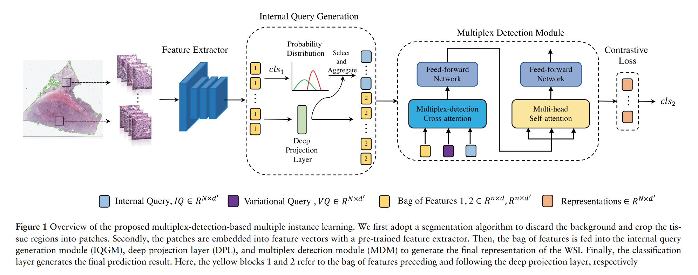
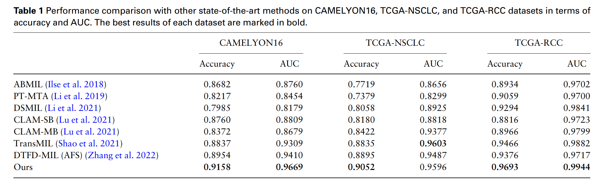

# MDMIL-for-Whole-Slide-Image-Classification
This is the official pytorch implementation of MDMIL[Targeting tumor heterogeneity: multiplex-detection-based multiple instance learning for whole slide image classification (Bioinformatics 2023)](https://academic.oup.com/bioinformatics/article/39/3/btad114/7067746).


## Pipline
<div align="center">
  
 </div>
 
 ## Experiment Results on five TCGA tumor datasets
 <div align="center">
  
 </div>

 
 ## Requirements
 ### Installation
Please install pytorch version >=1.2

 ### Dataset Preparation
 Please download the official [TCGA datasets](https://www.cancer.gov/ccg/research/genome-sequencing/tcga) of BRCA, BLCA, GBMLGG, LUAD, and UCEC. 
 For more details of pre-processing, please refer to [CLAM](https://github.com/mahmoodlab/CLAM).
 
 ## Model training and testing
 before training and testing, please update configs. Generally, we train the model with one 12 GB memory GPU. The output details in terms of loss, accuracy, and AUC will be stored in the logs folder. 
 ~~~~~~~~~~~~~~~~~~
   python train.py 
 ~~~~~~~~~~~~~~~~~~

## Citation

If you find this code useful for your research, please cite our paper

```
@article{wang2023targeting,
  title={Targeting tumor heterogeneity: multiplex-detection-based multiple instance learning for whole slide image classification},
  author={Wang, Zhikang and Bi, Yue and Pan, Tong and Wang, Xiaoyu and Bain, Chris and Bassed, Richard and Imoto, Seiya and Yao, Jianhua and Daly, Roger J and Song, Jiangning},
  journal={Bioinformatics},
  volume={39},
  number={3},
  pages={btad114},
  year={2023},
  publisher={Oxford University Press}
}
```

## Contact

If you have any question, please feel free to contact us. E-mail: [zhikang.wang@monash.edu](zhikang.wang@monash.edu) 

